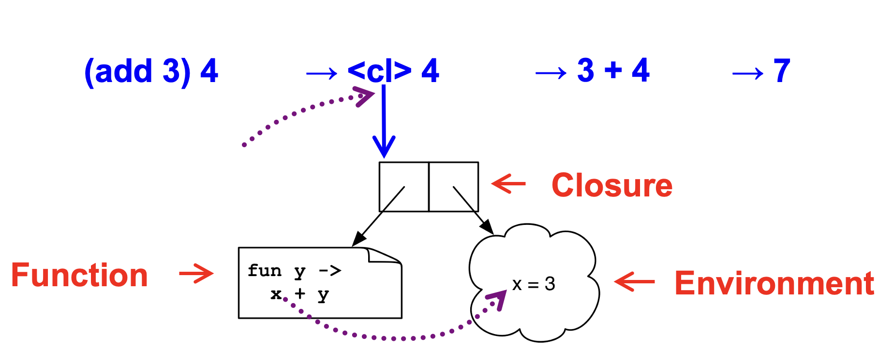
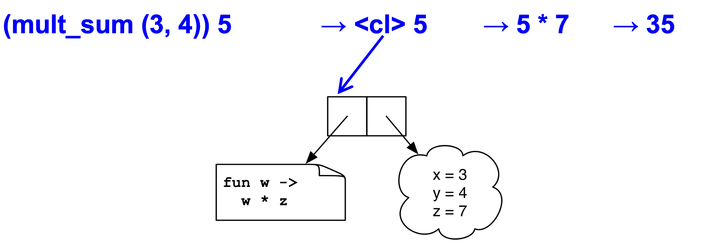

### Closures  (Implementing Higher Order Functions)
In OCaml you can pass functions as arguments
to `map`, `fold`, etc. For example, you can pass an anonymous function `fun x-> x * 2` as an argument to `map`
```ocaml
List.map (fun x-> x * 2) [1;2;3;4;5]
```
You can return functions as results as well. 
```ocaml
# let pick_fn n =
  let plus3 x = x + 3 in
  let plus4 x = x + 4 in
  if n > 0 then plus3 else plus4
val pick_fn : int -> (int->int) = <fun>
```
Here, `pick_fn` takes an `int` argument, and returns a function. The type of `pick_fn` is `int -> (int->int)`

#### Multi-argument Functions
Consider a rewriting of the function `pick_fn`
```ocaml
let pick_fn n =
  if n > 0 then (fun x->x+3) else (fun x->x+4)
```
Here’s another version
```ocaml
let pick_fn n = 
  (fun x -> if n > 0 then x+3 else x+4)
```
The shorthand for which is just
```ocaml
let pick_fn n x = 
  if n > 0 then x+3 else x+4
```
All the above implementation of `pick_fn` are same: take one `int` argument, and returns a function that takes another `int` argument. 

### Currying
We just saw a way for a function to take multiple arguments. I.e., no separate concept of multi-argument functions. We can encode one as a function that takes a single argument and returns a function that takes the rest. 

This encoding is called `currying` the function, named after the logician `Haskell B. Curry`. Three programming languages are named after him: `Haskell`, `Brook`, and `Curry`. Again, currying is the technique of translating a function that takes multiple arguments into a sequence of families of functions, each taking a single argument. 


OCaml syntax defaults to currying. E.g., 
```ocaml
let add x y = x + y
```
is identical to all of the following:
```ocaml
let add = (fun x -> (fun y -> x + y))
let add = (fun x y -> x + y)
let add x = (fun y -> x+y)
```
Thus `add` has type `int -> (int -> int)`. `add 3` has type `int -> int`, and `add 3` is a function that `adds 3` to its argument. For example: `(add 3) 4 = 7`. This works for any number of arguments. Here is another example a curried add function with three arguments:
```ocaml
let add x y z = x + y + z
```
is same as
```ocaml
let add x = (fun y -> (fun z -> x+y+z))
```
Then
* `add` has type `int -> (int -> (int -> int))`
* `add 4` has type `int -> (int -> int)`
* `add 4 5` has type `int -> int`
`add 4 5 6` is `15`

#### Syntax Conventions for Currying
Because currying is so common, OCaml uses the following conventions:
* `->` associates from the right. Thus `int -> int -> int` is the same as `int -> (int -> int)`. 

* function application associates from the left. Thus `add 3 4` is the same as `(add 3) 4`. 

#### Syntax trick: `function` vs. `fun` 
* Syntax `fun x y … z -> e` is for curried functions
* Syntax `function ps` is for single-argument functions, where `ps` has the form `p1 -> e1 | … | pn -> en`. This permits more expressive patterns. E.g., can write 
```ocaml
let rec sum l = match l with
  [] -> 0
| (h::t) -> h + (sum t)
````
as 
```ocaml
let rec sum = function
   [] -> 0
 | (h::t) -> h + (sum t)
```

Another way you could encode support for multiple arguments is using tuples. 
```ocaml
let foo (a,b) = a / b (* int*int -> int *)
let bar a b = a / b (* int-> int-> int *)
```
Function `foo` takes a single argument, a tuple with two elements. Function `bar` takes two arguments. As the result, `bar` supports partial application. It is useful when you want to provide some arguments now, the rest later. 
```ocaml
let div10 = bar 10;;
div10 2;; (* evaluates to 5 *)
```

Currying is standard in OCaml. Pretty much all functions are curried, such as standard library `map`, `fold`, etc. In particular, look at the file `list.ml` for standard list functions. Here is the link to the implemntation of `map` in List module: https://github.com/ocaml/ocaml/blob/trunk/stdlib/list.ml#L80. 

#### How Do We Implement Currying?
OCaml makes currying efficient because otherwise it would do a lot of useless allocation and destruction of closures. But implementing currying is tricky. Consider:

```ocaml
let addN n l =
  let add x = n + x in
map add l
```
The inner function `add` accesses the variable `n`
from the outer scope. `AddN` is equivalent to
```ocaml
let addN n = (fun l -> map (fun x -> n + x) l)
```
When the anonymous function is called by `map`, `n` may not be on the stack any more because the the function `addN` terminates before `map` is called.  We need some way to keep `n` around after `addN` returns. 

Another Example
```ocaml
let foo x = 
  let bar = fun y -> x + y in 
 bar

foo 10 => (fun y -> x + y) 10? 
```
Where is `x` when `(fun y -> x + y)` executes?

When a function is defined, OCaml createa an environment for the function. It is a mapping from variable names to values, just like a stack frame. We call function and its environment together a closure. A closure is a pair `(f, e)` consisting of function code `f` and an environment `e`. When you invoke a closure, `f` is evaluated using `e` to look up variable bindings. 
#### Example 1
```ocaml
let add x = (fun y -> x + y)
```
`add 3` returns a closure where the function body is `fun y -> x + y` and the environment contains `x=3`. When we apply this closure to another argument `4`, it calculates `x+y` by binding `y` to `4`, and evaluating `x` from its environment to `3` as shown in the image below. 

Here is another example:
```ocaml
let mult_sum (x, y) =
  let z = x + y in
fun w -> w * z
```

`mult_sum (3,4)` returns a closure where the function is `fun w -> w * z` and its environment contains the bindings for `x,y`, and `z`. 

####  Scope
Scope refers to the places in a program where a variable is visible and can be referenced. Scoping rules are all about how to evaluate free variables in a function. It is generally divided into two classes:  dynamic scope and static scope (also called lexcial scope).  
* Dynamic scope
The body of a function is evaluated in the current dynamic environment at the time the function is called, not the old dynamic environment that existed at the time the function was defined. 

* Lexical scope
The body of a function is evaluated in the old dynamic environment that existed at the time the function was defined, not the current environment when the function is called. 

What does this expression should evaluate to?
```ocaml
let x = 1 in 
let f = fun y -> x in
let x = 2 in 
f 0
```
With lexcial scoping, when `f 0` is evaluated, `x` refers to `1`, the value when the function `f` is defined. Therefore, this expression evalues to 1. However, with dynamic scoping, `x` refers to `2`, the value in the environment when then function is called. Therefore, this expression evalues to `2`. OCaml and most modern languages use lexcial scoping. If you try the above example in `Utop`, it should evaluate to `1`.  


### Higher-Order Functions in C
C supports function pointers. The function `app` takes a function pointer as an argument, and applies that function to each member of the array. Therefore, `app` is basically a higher order function. 
```c
typedef int (*int_func)(int);
void app(int_func f, int *a, int n) {
  for (int i = 0; i < n; i++)
    a[i] = f(a[i]);
}
int add_one(int x) { return x + 1; }
int main() {
  int a[] = {5, 6, 7};
  app(add_one, a, 3);
}
```
But C does not support closures.  Since no nested functions allowed, unbound symbols (free variable) always in global scope
```c
int y = 1;
void app(int(*f)(int), n) {
  return f(n);
}
int add_y(int x) { 
  return x + y;  //takes y from the global scope
}
int main() {
  app(add_y, 2);
}
```
In C, we cannot access non-local variables. For example, given the following OCaml code: 
```ocaml
let add x y = x + y
```
Equivalent code in C is illegal
```c
int (* add(int x))(int) {
  return add_y;
}
int add_y(int y) { 
  return x + y; /* error: x undefined */
}
```
Java 8 and many other languages now supports lambda expressions and closures. 
Ocaml’s 
```ocaml
fun (a, b) -> a + b
```
Is like the following in Java 8
```java
(a, b) -> a + b
```
