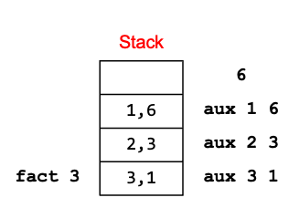

### Passing Functions as Arguments
In OCaml you can pass functions as arguments. 
```ocaml
let plus3 x = x + 3 (* int -> int *)

let twice f z = f (f z) (* ('a->'a) -> 'a -> 'a *)
(* pass the function plus3 as a argument to function twice *)
twice plus3 5  (* 11  *)
(* The function twice will apply plus3 to 5 two times.*)

twice plus3 5
plus3 (plus3 5)
plus3 8
11

```

### The Map Function
OCaml’s map is a higher order function. `map f l` takes a function `f` and a list `l`, applies function `f` to each element of `l`, and returns a list of the results (**preserving order**)

In the following example, `map` apples `add_one` to each element of the list `[1;2;3]`.
```ocaml
 let add_one x = x + 1
 map add_one [1; 2; 3]
 - : int list = [2; 3; 4]
```
In the following example, `map` apples `negate` to each element of the list `[9; -5; 0]`.
```
let negate x = -x
map negate [9; -5; 0]
- : int list = [-9; 5; 0]
```
#### Implementing map
```ocaml 
let rec map f l = 
  match l with
    [] -> []
  | h::t -> (f h)::(map f t)
  ```

#### What is the type of map?
```ocaml
('a -> 'b) -> 'a list -> 'b list
```
#### Example
Apply a list of functions `neg`, `add_one`, and `double` to a list of ints. 
```ocaml
let neg x = -x;;
let add_one x = x+1;;
let double x = x + x;;
let fs = [neg; add_one; double];; (* (int -> int) list *)
let lst = [1;2;3];;
map (fun f-> map f lst) fs
- : [[-1; -2; -3]; [2; 3; 4]; [2; 4; 6]]
```
In the above example, the outer `map` applies the anonymous function to each element of the the list `fs`.
```ocaml
map (fun f-> map f lst) fs →
map (fun f-> map f [1;2;3]) [neg; add_one; double] →
((fun f-> map f [1;2;3]) neg) :: map (fun f-> map f [1;2;3]) [add_one; double]
[-1; -2; -3]::map (fun f-> map f [1;2;3]) [add_one; double] →

[-1; -2; -3]::((fun f-> map f [1;2;3]) add_one) :: map (fun f-> map f [1;2;3]) [double] →

[-1; -2; -3]::[2; 3; 4]::map (fun f-> map f [1;2;3]) [double] →

[-1; -2; -3]::[2; 3; 4]::((fun f-> map f [1;2;3]) double) map (fun f-> map f [1;2;3]) [] →

[-1; -2; -3]::[2; 3; 4]::[2; 4; 6]::[] →
```

### Fold
Fold is a higher order function that takes a function of two arguments, a final value, and a list processes the list by applying the function to the head and the recursive application of the function to the rest of the list, returning the final value for the empty list.
```ocaml
let rec fold f a l =
  match l with
    [] -> a
  | h::t -> fold f (f a h) t
```

 For example:
```
let add x y = x + y
fold add 0             [1; 2; 3] →
fold add (add 0 1)     [2; 3] →
fold add 1             [2; 3] →
fold add (add 1 2)     [3] →
fold add 3             [3] →
fold add (add 3 3)     [] →
fold add 6            [] →
6  (* 1 + 2 + 3 *)
```

What does fold do?
```ocaml
fold f        v		   [v1; v2; …; vn] 
= fold f    (f v v1)	   [v2; …; vn]
= fold f (f (f v v1) v2)  […; vn]
= …
= f (f (f (f v v1) v2) …) vn
e.g., fold add 0 [1;2;3;4] = 
      add (add (add (add 0 1) 2) 3) 4 = 10
```

#### Another Example: Using Fold to Build Reverse
Let’s build the reverse function with fold!
```ocaml
let prepend a x = x::a
fold prepend [] [1; 2; 3; 4] →
fold prepend [1] [2; 3; 4] →
fold prepend [2; 1] [3; 4] →
fold prepend [3; 2; 1] [4] →
fold prepend [4; 3; 2; 1] [] →
[4; 3; 2; 1]
```

The `fold` function is implemented in OCaml Lst module as `List.fold_left`. OCaml List module also provides another implementation of fold called `fold_right`, which processes the list from tail to head. 
```ocaml
let rec fold_right f l a =
  match l with
    [] -> a
  | h::t -> f h (fold_right f t a)
```
Depending on the function, the `fold_left` and `fold_right` may yield different results. 
```ocaml
List.fold_left (fun x y -> x – y) 0 [1;2;3] = -6
(* since ((0-1)-2)-3) = -6 *)

List.fold_right [1;2;3] (fun x y -> x – y) 0 = 2 
(* since 1-(2-(3-0)) = 2 *)
```

#### When to use one or the other?
Many problems lend themselves to `fold_right`, but it does present a performance disadvantage. 
The recursion builds of a deep stack: One stack frame for each recursive call of `fold_right`. An optimization called `tail recursion` permits optimizing `fold_left` so that it uses no stack at all. 

#### Examples
Product of an int list
```ocaml
let mul x y = x * y;; 
let lst = [1; 2; 3; 4; 5];;
fold mul 1 lst
- : int = 120
```
Collect even numbers in the list
```ocaml
let f acc y = if (y mod 2) = 0 then y::acc  
              else acc;;
fold f [] [1;2;3;4;5;6];; 
- : int list = [6; 4; 2]
```
Count elements of a list satisfying a condition
```ocaml
let countif p l = 
fold (fun counter element -> 
       if p element then counter+1 
       else counter) 0 l ;;

countif (fun x -> x > 0) [30;-1;45;100;0];;

- : int = 3
```
Permute a list
```ocaml
let permute lst =
  let rec rm x l = List.filter ((<>) x) l
  and insertToPermute lst x =
    let t = rm x lst in
    List.map ((fun a b->a::b) x )(permuteall t)
  and permuteall lst =
    match lst with
    |[]->[]
    |[x]->[[x]]
    |_->List.flatten(List.map (insertToPermute lst) lst)
  in permuteall lst

  # permute [1;2;3];;
  - : int list list =
  [[1; 2; 3]; [1; 3; 2]; [2; 1; 3]; [2; 3; 1]; [3; 1; 2]; [3; 2; 1]]
  
```
Power Set
```ocaml
let populate a b =
  if b=[] then [[a]]
  else  let t = List.map (fun x->a::x) b in
        [a]::t@b

let powerset lst = List.fold_right populate lst []

# powerset [1;2;3];;
- : int list list = [[1]; [1; 2]; [1; 2; 3]; [1; 3]; [2]; [2; 3]; [3]]
```
Inner Product: given two lists of same size `[x1;x2;..xn]` and `[y1;y2;...yn]`, compute
`[x1;x2;x3]∗[y1;y2;y3] = x1∗y1 + x2∗y2 +..+ xn∗yn`
```ocaml
let rec map2 f a b = 
    match (a,b) with
    |([],[])->([])
    |(h1::t1,h2::t2)->(f h1 h2):: (map2 f t1 t2)
    |_->invalid_arg "map2";;

let product v1 v2 = 
      fold (+) 0 (map2 ( * ) v1 v2);;
# val product : int list -> int list -> int = <fun>
product [2;4;6] [1;3;5];;
#- : int = 44
```
Find the maximum from a list
```ocaml 
let maxList lst = 
    match lst with 
     []->failwith "empty list" 
    |h::t-> fold max h t ;; 

maxList [3;10;5];; 
: int = 10 


maxList [3;10;5] →
fold max 3 [10:5] →
fold max (max 3 10) [5] →
fold max (max 10 5) [] →
fold max 10 [] →
10 
```
Sum of sublists: Given a list of int lists, compute the sum of each int list, and return them as list. 
```ocaml
let sumList  = map (fold (+) 0 );;
sumList [[1;2;3];[4;5;6];[10]];;
- : int list = [6; 15; 10]
```
Maximum contiguous sublist: Given an int list, find the contiguous sublist, which has the largest sum and return its sum.

Example:
    Input: [-2,1,-3,4,-1,2,1,-5,4]
    Output: 6
    Explanation: [4,-1,2,1] has the largest sum = 6
```ocaml 
let f (m, acc) h =
   let m = max m (acc + h) in
   let  x = if acc < 0 then 0 else acc in
   (m, x+h)
;;
let submax  lst = let (max_so_far, max_current) = 
        fold f (0,0) lst in   
        max_so_far

submax [-2; 1; -3; 4; -1; 2; 1; -5; 4];;
- : int = 6
```
## Tail Recursion
Whenever a function’s result is completely computed by its recursive call, it is called tail recursive. Its “tail” – the last thing it does – is recursive. 

Tail recursive functions can be implemented without requiring a stack frame for each call
No intermediate variables need to be saved, so the compiler overwrites them

Typical pattern is to use an accumulator to build up the result, and return it in the base case.

We have seen the recursive factorial function 
```ocaml
let rec fact  n = 
    if n = 0 then 1
    else n * fact (n-1)


-: fact 4 = 24
```
Now, let us look at how `fact 3` is executed:
```ocaml
fact 3 = 3 * fact 2
       = 3 * 2 * fact 1
       = 3 * 2 * 1 * fact 0 
       = 3 * 2 * 1 * 1
       = 3 * 2 * 1
       = 3 * 2
       = 6	 
```
As shown below, each recursive call to the `fact` function will create a new stack frame in the memory. 
 
As such, if the recusrion is deep, it can cause `Stack overflow` error. For example:
```ocaml
let rec sum n = 
  if n = 0 then 0 
  else n + sum (n-1)

# sum 10000000;;
Stack overflow during evaluation (looping recursion?).
```

Now, let us look at another implementation of the factorial function
 
```ocaml
let fact n =
  let rec aux x a =
    if x = 0 then a
    else aux (x-1) x*a
  in 
  aux n 1
  ```
  Here is the execution of `fact 3`

   

In the first implementation of the factoral, it makes recursive calls `fact (n-1)`, and then it takes the return value of the recursive call and calculate the result `n * fact (n-1)`. In this manner, you don't get the result of your calculation until you have returned from every recursive call.

In the second implementation, it carries an accumulator `a`. It performs calculation first, and then you execute the recursive call, passing the results of the current step to the next recursive step. This results in the last statement being in the form of `(return (recursive-function params))`. Basically, the return value of the last recursive call is the final result. The consequence of this is that when you perforem the next recursive call, you do not need the current stack frame any more. 

As shown above, in the last recursive call to `fact 0`, it returns the result of `fact 3`. Therefore, we do not need all the stack frames for the previous recursive calls. This allows for some optimization. Some compilers can optimize the tail recursive calls to use only the current stack frame. This is called tail recusrion optimization. Functional programming language compilers usually optimizes the tail recursive calls because recusrion is the only way to achieve repetiton. 

Let us compare the two implemantion of factorial again:
```ocaml
(* Waits for recursive call’s result to compute final result *)
let rec fact n = 
    if n = 0 then 1
    else n * fact (n-1)

(* final result is the result of the recursive call *)
 let fact n =
   let rec aux x acc =
     if x = 1 then acc
     else aux (x-1) (acc*x)
   in 
  aux n 1
  ```
 Tail-recursive Sum of List
 ```ocaml
 (* non-tail recursive *)
 let rec sumlist l = 
   match l with
     [] -> 0
   | (x::xs) -> (sumlist xs) + x
 (* Tail-recursive version: *)
 let sumlist l = 
   let rec helper l a = 
     match l with
       [] -> a 0
     | (x::xs) -> helper xs (x+a) in
 helper l 0
 ```

 #### fold_left vs fold_right
 The `fold_left` is tail recursive and the `fold_right` is not tail recursive. The following examples calculates the sum of `10000000` integers. The `fold_left` returns the correct result, but `fold_right` raises a `Stack overflow` error. 
 ```ocaml
 List.fold_left (+) 0 (List.init 10000000 (fun _->1));;
- : int = 10000000

List.fold_right (+) (List.init 10000000 (fun _->1)) 0;;
Stack overflow during evaluation (looping recursion?).
```

Why? Let us look at the implementation of `fold_left` and `fold_right`.
```
let rec fold_left f a l =
  match l with
    [] -> a
  | h::t -> fold_left f (f a h) t

fold_left (+) 0 [1;2;3]
fold_left (+) 1 [2;3]
fold_left (+) 3 [3]
fold_left (+) 6 []
6


let rec fold_right f l a =
  match l with
    [] -> a
  | h::t -> f h (fold_right f t a)

fold_right (+) [1;2;3] 0
1 + (fold_right (+) [2;3] 0)
1 + (2 + (fold_right (+) [3] 0))
1 + (2 + (3 (fold_right (+) [] 0)))
1 + (2 + ( 3 + 0))
1 + (2 + 3)
1 + 5
6
```
For `fold_left`, the call to `fold_left` is in the form of `(return (recursive-function params))`.  There is no operation after the recursive call returns. However, for `fold_right`, after the recursive call to `fold_right` returns, we still need to perform the `f h recursive_call_return`. We need to keep the current stack frame before calling the next recurvie call. Therefore, `fold_right` is not tail recursive and cannot be optimized. 

Tail Recursion Pattern 
```ocaml
let func x =
  let rec helper arg acc =
    if (base case) then acc
    else
      let arg' = (argument to recursive call)
      let acc' = (updated accumulator)
      helper arg' acc' in (* end of helper fun *)
  helper x (initial val of accumulator)
```
Tail Recursion Pattern with fact
```ocaml
let fact x =
  let rec helper arg acc =
    if arg = 0 then acc
    else
      let arg' = arg – 1 in
      let acc' = acc * arg in
      helper arg' acc' in (* end of helper fun *)
  helper x 1
```
Tail Recursion Pattern with list reverse `rev`
```ocaml
let rev x =
  let rec rev_helper arg acc =
    match arg with [] -> acc
    | h::t -> 
      let arg' = t in
      let acc' = h::acc in
      rev_helper arg' acc' in (* end of helper fun *)
  rev_helper x []
```
