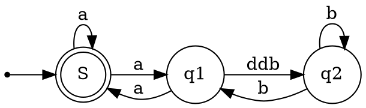
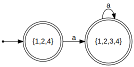

## Subset Construction (NFA to DFA Conversion) Examples

### Example 1

|States   | a  | b  | c  |
|:---:|:---:|:---:|:---:|
|{0,2}| 1   | phi  | 2  | 
|1   | Ø  | {0,2}  | Ø  |  
|2   | Ø  | Ø  | c  |  

### Example 2

|States   | a  | b  |
|:---:|:---:|:---:|
|{1,3}| Ø   | {2,4}  | 
|{2,4}| {2,3}  |Ø  |  
|{2,3} | {2,3}  | 4  |    
|4 | Ø  | Ø  |    

### Example 3

|States   | a  | 
|:---:|:---:|
|{1,3,4}|{1,2,3,4}  | 
|{1,2,3,4}| {1,2,3,4}  | 

### Example 4

|States | 0| 1 |
|:---:|:---:|:---:|
|{A,C} |{B,C} |{C,D}|
|{B,C} |C |{C,D}|
|C |C |{C,D}|
|{C,D} |C |{C,D}|

### Example 5

|States | a| b |
|:---:|:---:|:---:|
|0 |{0,1} |Ø|
|{0,1} |{0,1} |{2,3}|
|{2,3} |{0,1} |{2,3,4}|
|{2,3,4} |{0,1} |{2,3,4}|

