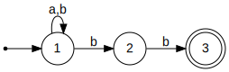
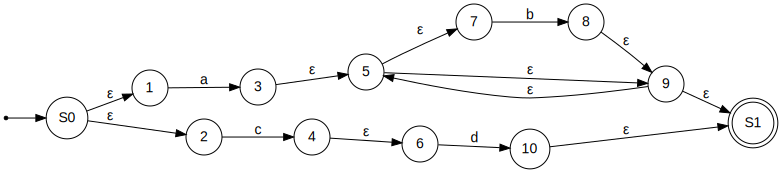

## Subset Construction (NFA to DFA Conversion) Examples

### Subset Construction Algorithm

Let $r_0$ = $\varepsilon\text{-closure}(\delta, q_0)$, add it to $R$\
While $\exists$ an unmarked state $r \in R$:\
&nbsp;&nbsp;&nbsp;&nbsp;&nbsp;&nbsp;Mark $r$\
&nbsp;&nbsp;&nbsp;&nbsp;&nbsp;&nbsp;For each $\sigma \in \Sigma$\
&nbsp;&nbsp;&nbsp;&nbsp;&nbsp;&nbsp;&nbsp;&nbsp;&nbsp;&nbsp;&nbsp;&nbsp;Let $E = \text{move}(\delta, r, \sigma)$\
&nbsp;&nbsp;&nbsp;&nbsp;&nbsp;&nbsp;&nbsp;&nbsp;&nbsp;&nbsp;&nbsp;&nbsp;Let $e = \varepsilon\text{-closure}(\delta, E)$\
&nbsp;&nbsp;&nbsp;&nbsp;&nbsp;&nbsp;&nbsp;&nbsp;&nbsp;&nbsp;&nbsp;&nbsp;If $e \notin R$\
&nbsp;&nbsp;&nbsp;&nbsp;&nbsp;&nbsp;&nbsp;&nbsp;&nbsp;&nbsp;&nbsp;&nbsp;&nbsp;&nbsp;&nbsp;&nbsp;&nbsp;&nbsp;Let $R = R \cup \\{e\\}$\
&nbsp;&nbsp;&nbsp;&nbsp;&nbsp;&nbsp;&nbsp;&nbsp;&nbsp;&nbsp;&nbsp;&nbsp;Let $\delta' = \delta' \cup \\{ r, \sigma, e \\} $\
Let $F = \\{r \mid \exists s \in r \text{ with } s \in F_n \\}$

### Example 1


|States   | a  | b  | c  |
|:---:|:---:|:---:|:---:|
|{0,2}| 1   | phi  | 2  | 
|1   | Ø  | {0,2}  | Ø  |  
|2   | Ø  | Ø  | 2  |  


### Example 2


|States   | a  | b  |
|:---:|:---:|:---:|
|{1,3}| Ø   | {2,4}  | 
|{2,4}| {2,3}  |Ø  |  
|{2,3} | {2,3}  | 4  |    
|4 | Ø  | Ø  |    


### Example 3


|States   | a  | 
|:---:|:---:|
|{1,2,4}|{1,2,3,4}  | 
|{1,2,3,4}| {1,2,3,4}  | 


### Example 4


|States | 0| 1 |
|:---:|:---:|:---:|
|{A,C} |{B,C} |{C,D}|
|{B,C} |C |{C,D}|
|C |C |{C,D}|
|{C,D} |C |{C,D}|


### Example 5


|States | a| b |
|:---:|:---:|:---:|
|0 |{0,1} |Ø|
|{0,1} |{0,1} |{2,3}|
|{2,3} |{0,1} |{2,3,4}|
|{2,3,4} |{0,1} |{2,3,4}|


### Example 6
#### Language:
```
 (a|b)*bb
```
#### NFA



|States | a| b |
|:---:|:---:|:---:|
|1 |1 |{1,2}|
|{1,2} |1 |{1,2,3}|
|{1,2,3} |1 |{1,2,3}|
#### DFA


### RE to NFA Example
```
ab*|cd
```
