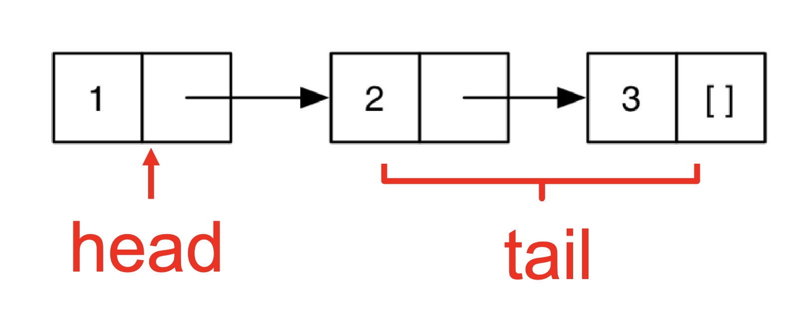

# Functional Programming with OCaml

Caml is a dialect of the ML programming language family, developed in France at INRIA. OCaml is the main implementation of the programming language Caml. The features of ML include:
* First-class functions
  * Functions can be data. We can send functions as  parameters to other functions and return functions as return values.
* Favor immutability (assign once)
* Data types and pattern matching
  * Convenient for certain kinds of data structures
* Type inference
  * OCaml is statically typed, but there is no need to write types in the source language
  * Supports parametric polymorphism, similar to Generics in Java, templates in C++
* Exceptions
* Garbage collection

## Resources
### Books
* Developing Applications with Objective Caml (https://caml.inria.fr/pub/docs/oreilly-book/ocaml-ora-book.pdf)
* Introduction to the Objective Caml Programming Language (http://courses.cms.caltech.edu/cs134/cs134b/book.pdf)
* Real World OCaml 2nd Edition (https://dev.realworldocaml.org/)
* OCaml from the Very Beginning (https://johnwhitington.net/ocamlfromtheverybeginning/mlbook.pdf)
* Cornell cs3110 book is another course which uses OCaml; it is more focused on programming and less on PL theory than this class is.
* `ocaml.org` is the home of OCaml for finding downloads, documentation, etc. The tutorials are also very good and there is a page of books.


## Similar Courses
* CS3110 (Cornell)
* CSE341 (Washington)
 * 601.426 (Johns Hopkins)
* COS326 (Princeton)
* CS152 (Harvard)
* CS421 (UIUC)

## Installing OCaml
Install the latest version of OCaml from https://ocaml.org/

## OPAM: OCaml Package Manager
opam is the package manager for OCaml. It manages libraries and different compiler installations. For the class projects, you should install the following packages with `opam`. 
 * ounit, a testing framework similar to minitest
 * utop, a top-level interface
 * dune, a build system for larger projects


## Working with OCaml

* OCaml programs can be compiled using `ocamlc`. It produces `.cmo` (compiled object) and `.cmi` (compiled interface) files. You can use `-o` to set output file name, and use `-c` to compile only to `.cmo/.cmi` and not to link. You can also compile with `ocamlopt`. It produces `.cmx` files, which contain native code: faster, but not platform-independent (or as easily debugged)

## Project Builds with dune

You use dune to compile projects. It automatically finds dependencies, invokes compiler and linker. Let us create a new project with `dune`:
```
dune init project HelloWorld
```
It creates a `HelloWorld` project with the following files:
```
HelloWorld
├── HelloWorld.opam
├── _build
│   └── log
├── bin
│   ├── dune
│   └── main.ml
├── dune-project
├── lib
│   └── dune
└── test
    ├── dune
    └── test_HelloWorld.ml
```
Build the project:
```
dune build
```
Run it:
```
dune exec bin/main.exe
```
or
```
_build/default/main.exe
```
Run the tests
```
dune runtest
```

## OCaml Basics

OCaml files are written with a ``.ml`` extension. An OCaml file is similar to a Python file: when run, it evaluates the file directly. There is no special main function. An OCaml file consists of

* A series of open statements for including other modules
* A series of declarations for defining datatypes, functions, and constants
* A series of (though often just one) toplevel expressions to evaluate.

### Example: hello.ml:
```ocaml
(* A small OCaml program *)
print_string "Hello world!\n";;
```
Or
```ocaml
open Printf
let message = "Hello world";;
(printf "%s\n" message)
```
The first line includes the built-in library for printing, which provides functions similar to `fprintf` and `printf` from `stdlib` in `C`. The next two lines define a constant named message, and then call the `printf` function with a format string (where `%s` means "format as string"), and the constant message we defined on the line before.

To compile and run
```ocaml
ocamlc hello.ml
./a.out
Hello world!
```

We can also compile multiple files to generate a single executable. 

```ocaml
(* main.ml *)
let main () =
  print_int (Util.add 10 20); print_string "\n"
let () = main ()

(* util.ml *)
let add x y = x + y
```
Compile and run:
```ocaml
ocamlc util.ml main.ml
```
Or compile separately

```ocaml
ocamlc -c util.ml
ocamlc util.cmo main.ml
```

It generates an executable a.out. We can execute it by
```ocaml
./a.out
```

### OCaml toplevel, a REPL for OCaml
We will begin exploration of OCaml in the interactive top level. A top level is also called a read-eval-print loop (REPL) and it works like a terminal shell. To run the ocaml topleve, simply run `ocaml`
```ocaml
 % ocaml
 OCaml version 5.2.0
 # print_string "Hello world!\n";;
    Hello world!
 - : unit = ()
```
There is an alternative toplevel called `utop`. It is more user friendly, and we will be using `utop` in the class. You can install `utop` by runnung `opam install utop`. Follow the instructions in the project 0 for installing opam and ocaml. 

To load a `.ml` file into top level:
```ocaml
#use "filename.ml"
```
To exit the top-level, type ^D (Control D) or call the exit 0
```ocaml
# exit 0;;
```

### First OCaml Example
```ocaml
(* A small OCaml program (* with nested comments *) *)
let x = 37;;
let y = x + 5;;
print_int y;;
print_string "\n";;
```

OCaml is strictly typed. It does not implicitly cast types. For example, `print_int` only prints `int`s. 
```ocaml
print_int 10;;
    10- : unit = ()
```
`()` is called unit. It is similar to `void` in other languages. Following expressions do not type check
```ocaml
print_int 10.5;;
    Error: This expression has type float but an expression was expected of type int
```
becase `print_int` does not take `float` as an argument. The following code does not typecheck because `+` operator requires both operands are integers.  
```ocaml
1 + 0.5;;
Error: This expression has type float but an expression was expected of type int

1 + true;;
    Error: This expression has type bool but an expression was expected of type int
```
As expected, `print_int` does not a string as an argument.
```
print_int "This function expected an int";;
    Error: This expression has type string but an expression was expected of type int
```

## Expressions
 Expressions are our primary building block, akin to statements in imperative languages. Every kind of expression has syntax and semantics. Semantics include:
  * Type checking rules (static semantics): produce a type or fail with an error message
  * Evaluation rules (dynamic semantics): produce a value or an exception or infinite loop. Evaluation rules are used only on expressions that type-check

We use metavariable `e` to designate an arbitrary expression.

## Values
A value is an expression that is final. For example, `34` and `true` are values because we cannot evaluate them any further. On the contrary, `34+17` is an expression, but not a value because we can further evaluate it. Evaluating an expression means running it until it is a value. For example `34+17` evaluates to 51, which is a value. We use metavariable `v` to designate an arbitrary value

## Types
Types classify expressions. It is the set of values an expression could evaluate to. Examples include `int`, `bool`, `string`, and more. We use metavariable `t` to designate an arbitrary type. Expression `e` has type `t` if `e` will (always) evaluate to a value of type `t`. For example `0`, `1`, and `-1` are values of type `int` while `true` has type `bool`. `34+17` is an expression of type `int`, since it evaluates to `51`, which has type `int`. We usually write `e : t` to say `e` has type `t`.  The process of determining `e` has type `t` is called `type checking` simply, `typing`.

### if expression

Syntax
```ocaml
if e1 then e2 else e3
```
Type checking rules

- if `e1 : bool` and `e2 : t` and `e3 : t` then 
    - `if e1 then e2 else e3 : t`

Examples:
```ocaml
 if 7 > 42 then "hello" else "goodbye";;
    - : string = "goodbye"
```
The follwing expression does not type check because the two branches of the `if` expressin do not return the same type. The `true` branch returns `string`, while the `false` branch returns `int`
```ocaml
if 7 > 42 then "hello" else 10;;
    Error: This expression has type int but an expression was expected of type string
```

Evaluating an expression returns a value. For example, evaluaing `(if 10 > 5 then 100 else 200)` retuens `100`. 
```ocaml
print_int (if 10>5 then 100 else 200);;
100- : unit = ()
```

## Functions
OCaml functions are like mathematical functions. They compute a result from provided arguments. We use `let` to define a function:

Factorial function:
```ocaml
let rec fact n =
  if n = 0 then
     1
  else
     n * fact (n-1);;
```
`rec` keyword is used to define `recursive` functions. `;;` ends an expression in the top-level of OCaml. We use it to say:  “Give me the value of this expression”. It is not used in the body of a function and it is not needed in the real OCaml development. 


### Calling Functions (Function Application)
Syntax 
```ocaml
f e1 e2 … en
```
Parentheses are not required around argument(s). There are no commas between the arguments. Instead, we use spaces. 

Evaluation

* Find the definition of f i.e., `let rec f x1 … xn = e`
* Evaluate arguments `e1 … en` to values `v1 … vn`
* Substitute arguments `v1, … vn` for params `x1, ... xn` in body e 
  * Call the resulting expression `e’`
* Evaluate `e’` to value v, which is the final result

Follwoing is an example of evaluating `fact 2`
```ocaml
let rec fact n =
    if n = 0 then
       1
    else
       n * fact (n-1)
```
|     expression        | semantics |
| ------------ | ------- |
| fact 2  | substitute every occurence of n inside the body of fact with 2    |
| if 2=0 then 1 else 2*fact(2-1)| evaluate the if expression|
|2 * fact 1 | result of the else branch|
|2 * (if 1=0 then 1 else 1*fact(1-1))| substitute n with 1 |
|2 * 1 * fact 0||
|2 * 1 * (if 0=0 then 1 else 0*fact(0-1))||
|2 * 1 * 1||
|2 | |


### Function Types

In OCaml, `->` is the function type constructor. Type `t1 -> t` is a function with argument or domain type `t1` and return or range type `t`. Type `t1 -> t2 -> t` is a function that takes two inputs, of types `t1` and `t2`, and returns a value of type `t`.


### Type Checking of Function application
As we have seen before, the syntax of a function application is 
```ocaml
f e1 … en
```
We use the following type checking rule for the function application:
If `f : t1 -> … -> tn -> u` and   `e1 : t1,  …, en : tn` then the type of `f e1 … en` is `u`. For example: the type of `not true` is `bool` because `not : bool -> bool` and `true : bool`. 


#### More Examples on Function Type Checking

The function `next` calculates the next integer. 
```ocaml
let next x = x + 1;;
```
If you enter the above code to `utop`, it shows the type `next` as
```ocaml
next : int -> int
```
Here is how `ocaml` inferred the type of `next` as `int->int`: `+` is an integer addition operator. Both operands of `+` must be integer. It means `x` must be an integer. There the argument type and return type are `int`. `next` is a function, which takes an `int` as n argument, and returns an `int` value.
```ocaml
next 10;;
- : int = 11

# next 10.5;;
Error: This expression has type float but an expression was expected of type int. 
```
The functions `swap` and `eq` are polymorphic function. The types `'a` and `'b` can be read as `for all type a and b`
```ocaml
(* Swapping two values *)
let swap (x,y) = (y,x);;
swap : 'a * 'b -> 'b * 'a
```
```ocaml
(* Comparing other types *)
let eq (x,y) = x = y;; 
eq : 'a * 'a -> bool
```
```ocaml
(* Adding two integers *)
let add x y = x + y;;
add : int -> int -> int
```
```ocaml
let fn x = (int_of_float x) * 3;;
fn : float -> int = <fun>
```
```ocaml
(* factorial function *)
let rec fact n =
  if n = 0 then
     1
  else
     n * fact (n-1);;
fact;;
fact: int -> int
```
```ocaml
(* Sum of the first n natural numbers *)

let rec sum n = 
  if n == 0 then 0 else n + sum (n-1)

sum: int -> int
```
```ocaml
(* mutually recusrive functions *)
let rec odd n = 
  if n == 0 then false 
  else even(n-1)
and
  even n = 
    if n == 0 then true
    else odd(n-1)
```

### Type annotations
OCaml compiler infers the types. But type inference is tricky. It gives vague error messages. We can annotate types manually. 
```ocaml
let (x : int) = 3;;
val x : int = 3
```
```ocaml
let fn (x:int):float = (float_of_int x) *. 3.14;;
    val fn : int → float
```
```ocaml
let add (x:int) (y:int):int = x + y
let id x = x (* 'a → 'a *)
let id (x:int) = x (* int → int *)
```

## Lists in OCaml
List is a basic data structure in OCaml. Lists can be of arbitrary length and implemented as a linked data structure. Lists must be homogeneous, meaning all elements have the same type. We will learn how to construct lists and destruct them via pattern matching. 

### Evaluation
`[ ]` is a value. To evaluate `[e1; e1;...;en]`, we evaluate `e1` to a value `v1`, `e2` to a value `v2`, and `en` to a value `vn`, and return `[v1;…;vn]`.
`e1::e2` is a desugaring of [e1;e2].

```ocaml
# let y = [1; 1+1; 1+1+1] ;;
val y : int list = [1; 2; 3]

# let x = 4::y ;;
val x : int list = [4; 1; 2; 3]

# let z = 5::y ;;
val z : int list = [5; 1; 2; 3]

# let m = "hello" :: "bob" ::[];;
val m : string list = ["hello"; "bob"]
```

### Typing
The type of `Nil` is `'a list` i.e., empty list `[ ]` has type `t` list for any type `t`. The type of `Cons` is 
if `e1 : t` and `e2 : t list` then `e1::e2 : t list`. If we add parentheses for clarity: if `e1 : t` and `e2 : (t list)` then `(e1::e2) : (t list)`.

```ocaml
# let m = [[1];[2;3]];;
val y : int list list = [[1]; [2; 3]]

# let y = 0::[1;2;3] ;;
val y : int list = [0; 1; 2; 3]

# let x = [1;"world"] ;; (* all elements must have same type *)

This expression has type string but an expression was expected of type int
```
`::` operator appends a single item, not a list, to the front of another list. The left argument of `::` is an element, the right is a list
```ocaml
# let w = [1;2]::y ;; 
This expression has type int list but is here used with type int list list
```

Can you construct a list y such that `[1;2]::y` makes sense? 

Yes. If the type of `y` is `int list list`,i.e., `[1;2]::[[3;4]]`. Each element of this list is an `int list`.

Lists in Ocaml are Linked. `[1;2;3]` is represented as:
. 

A nonempty list is a `pair (element, rest of list)`. The `element` is the head of the list, and `rest of the list` is itself a list. Thus in math (i.e., inductively) a list is either 
* The empty list [ ]
*  Or a pair consisting of an element and a list

This recursive structure will come in handy shortly

### Lists of Lists
Lists can be nested arbitrarily. For exmaple: `[ [9; 10; 11]; [5; 4; 3; 2] ]`. Type `int list list`, also written as `(int list) list`.  Lists are Immutable. 	No way to mutate (change) an element of a list. 	Instead, build up new lists out of old, e.g., using `::`. 

### Pattern Matching
To pull lists apart, we use the `match` construct. The pattern-matching part of the `match` is a sequence of clauses, each one of the form: `pattern -> expr`, separated by vertical bars (|). The clauses are processed in order, and only the `expr` of first matching clause is evaluated. The value of the entire match expression is the value of the `expr` of the matching clause; If no `pattern` matches `expr`, your match is said to be `non-exhaustive` and when a match fails it raise the exception `Match_failure`.
Syntax
```ocaml
match e with 
| p1 -> e1 
| … 
| pn -> en
```
### Pattern Matching Example
```ocaml
(* get  the head of a list *)
let hd l = 
  match l with 
  (h::t) -> h

hd [1;2;3](* evaluates to 1 *)
hd [2;3]  (* evaluates to 2 *)
hd [3]    (* evaluates to 3 *)
hd []	    (* Exception: Match_failure *)
```
 
### "Deep" pattern matching 
You can nest patterns for more precise matches
* `a::b` matches lists with **at least one element** 
	* `match [1;2;3] with |a::b` matches and binds `a` to `1` and `b` to `[2;3]` 
* `a::[]` matches lists with **exactly one element**
	* `match [1] with | a::[]` binds `a` to `1`. we could also write pattern `a::[]` as `[a]` 
* `a::b::[]` matches lists with **exactly two elements** 
	* `match [1;2] with |a::b::[]` binds `a` to 1 and `b` to 2. We could also write pattern a::b::[] as [a;b] 
* `a::b::c::d` matches lists with **at least three elements**. 
  * `match [1;2;3] with |a::b::c::d`, binds `a` to `1`, `b` to `2`, `c` to `3`, and `d` to `[]`.

**Cannot write pattern as [a;b;c]::d (why?)**

### Wildcards
An underscore `_` is a wildcard pattern. It matches anything, but doesn’t add any bindings. It is useful to hold a place but discard the value i.e., when the variable does not appear in the branch expression. 

In previous examples, many values of h or t ignored. We can replace with wildcard `_`. 

#### Example
```ocaml
(* cehck if a list is empty *)
let is_empty l = 
  match l with
 [] -> true	 
 | (_::_) -> false

let hd l = match l with (h::_) -> h 
let tl l = match l with (_::t) -> t
```

Outputs
```ocaml
is_empty[1](* evaluates to false *) 
is_empty[ ](* evaluates to true  *)
hd [1;2;3] (* evaluates to 1     *) 
hd [1]     (* evaluates to 1     *)
tl [1;2;3] (* evaluates to [2;3] *)
tl [1]     (* evaluates to [ ]   *)
```
### Pattern Matching – An Abbreviation
If f there’s only one acceptable input, the pattern matching `let f x = match x with p -> e` can be abbreviated to `let f p = e`.  For example: 
```ocaml
(* get the head (first item) of the list *)
let hd l = 
  match l with
  |h::_-> h

(* can be wrriten as:*)

let hd (h::_) = h
```
```ocaml
(* can be wrriten as:*)
let hd l = 
  match l with
  |_::t-> t

(* can be wrriten as: *)

let tl (_::t) = t
```

```ocaml
let f lst = 
match lst with 
|(x::y::_) -> x + y

(* can be wrriten as: *)
let f (x::y::_) = x + y
```
```ocaml
let f lst = 
  match lst with 
  |(x::y::[]) -> x + y
(* can be wrriten as: *)
```ocaml
let g [x; y] = x + y
```
### Pattern Matching Typing
If `e` and `p1`, ..., `pn` each have type `ta`
and `e1`, ..., `en` each have type `tb`, then entire match expression has type `tb`. 

### Polymorphic Types
The sum function works only for int  lists, but the `hd` function works for any type of list. 
```
hd [1; 2; 3]		(* returns 1 *)
hd ["a"; "b"; "c"]	(* returns "a" *)
```
OCaml gives such functions polymorphic types. 
```ocaml
hd : 'a list -> 'a
```
This says the function takes a list of any element type `'a`, and returns something of that same type. These are basically generic types in Java. 
`'a list` is like `List<T>`. 
### Examples of Polymorphic Types
```ocaml
let tl (_::t) = t
# tl [1; 2; 3];;
- : int list = [2; 3]
# tl [1.0; 2.0];;
- : float list = [2.0]
(* tl : 'a list -> 'a list *)
```
```ocaml
let fst x y = x
# fst 1 "hello";;
- : int = 1
# fst [1; 2] 1;;
- : int list = [1; 2]
(* fst : 'a -> 'b -> 'a *)
```

```ocaml
let eq x y = x = y   (* let eq x y = (x = y) *)
# eq 1 2;;
-	: bool = false
# eq "hello" "there";;
- : bool = false
# eq "hello" 1     -- type error
(* eq : 'a -> ’a -> bool *)
```
OCaml can detect non-exhaustive patterns and warn you about them. For example:
```ocaml
let hd l = match l with (h::_) -> h;;
Warning: this pattern-matching is not exhaustive.
Here is an example of a value that is not matched: []

# hd [];;
Exception: Match_failure ("", 1, 11).
```
Therefore, You can’t forget a case because compiler issues inexhaustive pattern-match warning. You can’t duplicate a case because compiler issues unused match case warning. Pattern matching leads to elegant, concise, beautiful code . 

### Lists and Recursion
Lists have a recursive structure and so most functions over lists will be recursive. 
```ocaml
let rec length l = 
  match l with
  |[] -> 0
  | (_::t) -> 1 + (length t)
```
This is just like an inductive definition: 
* The length of the empty list is zero
* The length of a nonempty list is 1 plus the length of the tail. 

Type of length is `'a list -> int`

```ocaml
(* sum of elts in l *) 
let rec sum l = match l with
    [] -> 0
  | (h::t) -> h + (sum t)
```
```ocaml
(* negate elements in list *)
let rec negate l = 
	match l with
     [] -> []
     | (h::t) -> (-h) :: (negate t)
```
```ocaml
(* last element of l *)
let rec last l = match l with
    [x] -> x
  | (h::t) -> last t
```

```ocaml
(* return a list containing all the elements in the list l followed by all the elements in list m *)
let rec append l m = match l with
   [] -> m
 | (x::xs) -> x::(append xs m)
```
```ocaml
rev l  (* reverse list; hint: use append *)
let rec rev l = match l with
    [] -> []
  | (x::xs) -> append (rev xs) (x::[])
```
`rev` takes O(n2) time.  Can you do better? Here is a  clever version of reverse
```ocaml
let rec rev_helper l a = match l with
    [] -> a
  | (x::xs) -> rev_helper xs (x::a)

let rev l = rev_helper l []
```
Let’s give it a try
```ocaml
rev [1; 2; 3] →
rev_helper [1;2;3] [] →
rev_helper [2;3] [1] →
rev_helper [3] [2;1] →
rev_helper [] [3;2;1] →
[3;2;1]
```
```ocaml
(* Check if a value is odd *)

let is_odd x =
		match x mod 2 with
		0 -> false
		| 1 -> true
		| _ -> raise (Invalid_argument "is_odd");;    (* why do we need this? *)
(* try -1 mod 2 *)
```

```ocaml
(* Negate a value *)
let neg b = 
	match b with
	| true -> false
	| false -> true;;
	
neg true;;
- : bool = false
neg (10 >20);;
- : bool = true
```
```ocaml
(* Logical implication *)
let imply v = match v with 
		 (true,true)   -> true
	   | (true,false)  -> false
	   | (false,true)  -> true
	   | (false,false) -> true;;
	
val imply : bool * bool -> bool = <fun>
```	
Or, we can make it even simpler:
```ocaml
let imply v = match v with 
  (true,x)  -> x
  | (false,x) -> true;;
val imply : bool * bool -> bool = <fun>
```

For characters, OCaml also recognizes the range patterns in the form of 'c1' .. 'cn' as shorthand for any ASCII character in the range.
```ocaml
let is_vowel c = 
	match c with 
	('a' | 'e' | 'i' | 'o' | 'u') -> true
	| _ -> false;;
```	

```ocaml	
let is_upper x = 
  match x with 
  'A' .. 'Z' -> true
  | _ -> false;;
```	
```ocaml
(* get the last element of a list *)
let rec last l=
	match l with 
	[]->[]
	|[x]->[x]
	|_::t->last t
```	
```ocaml
(* check if x is member of a list *)
let rec member lst x=
		match lst with
		|[]->false
		|h::t->if h = x then true else member t x
	;;
```
```ocaml
(* append list b to list a *)
let rec append a b=
		match a with
		|[]->b
		|h::t-> h::append t b
	;;
```
```ocaml
(* merge two sorted lists into one sorted list *)
let rec merge l1 l2 = 
  match l1,l2 with 
   [],l->l
   |l,[]->l
   |(h1::t1, h2::t2)->if h1 < h2 then h1::merge t1 l2 else h2::merge l1 t2 

merge [1;3;7;9] [2;3;4;5;6]
- : int list = [1; 2; 3; 3; 4; 5; 6; 7; 9]

```
```ocaml
(* insert x into a sorted list l in sorted order *)
let rec insert x l=
	match l with 
	|[]->[x]
	|h::t->if x < h then x::h::t 
			else h::insert x t
	
(* insertion sort *)
	let rec sort l = 
		match l with 
		[]->[]
		|[x]->[x]
		|h::t->insert h (sort t)
```
	
```ocaml
(* QuickSort *)
let rec qsort = function
		| [] -> []
		| pivot :: rest ->
		let left, right = List.partition (fun x-> x < pivot) rest in
	qsort left @ [pivot] @ qsort right
```	
```ocaml
(* MergeSort *)
(** split list a into two even parts *)
	let split a = 
	let rec aux lst b c = 
		  match lst with
		  [] -> (b, c)
		| hd :: tail -> aux tail c (hd :: b)
	in aux a [] []

(* merge lists xs and ys *)
let rec merge cmp xs ys =
		match (xs, ys) with
		  ([], []) -> [] 
		| (_, []) -> xs 
		| ([], _) -> ys
		| (xhd :: xtail, yhd :: ytail) -> 
		if (cmp xhd yhd) then
			xhd :: (merge cmp xtail ys)
	  else
			yhd :: (merge cmp xs ytail)
	
let rec mergesort cmp os  = 
		match os with
		[] -> []
		| [x] -> [x]
		| _ ->
		  let (ls, rs) = split os in
	merge cmp (mergesort cmp ls) (mergesort cmp rs)
```

### Let Expressions
let expressions bind local variables. 
#### Syntax
```ocaml
let x = e1 in e2
```
`x` is a bound variable; `e1` is the binding expression; `e2` is the body expression.


#### Evaluation
```ocaml
let x = e1 in e2
```
* Evaluate e1 to v1
* Substitute `v1` for `x` in `e2`, yielding new expression `e2’`
* Evaluate `e2’` to `v2`, the final result
Let Expressions

#### Type checking
* If e1 : t1 and if assuming `x : t1` implies `e2 : t` Then `(let x = e1 in e2) : t`

#### Let Definitions vs. Let Expressions 
At the top-level, we write `let x = e;;` (* no `in e2` part *). This is called a let definition, not a let expression because it doesn’t, itself, evaluate to anything. Omitting `in` means “from now on”:
```ocaml
# let pi = 3.14;;
(* pi is now bound in the rest of the top-level scope *)
```

We can write any expression at top-level, too
```ocaml
e;;
```
This says to evaluate `e` and then ignore the result. It is equivalent to 
```ocaml
let _ = e;;
```
Useful when `e` has a side effect, such as reading/writing a file, printing to the screen, etc.
```ocaml
let x = 37;;
let y = x + 5;;
print_int y;;
print_string "\n";;
```
When run, outputs 42 to the screen.

#### Let Expressions: Scope
In `let x = e1 in e2`, var `x` is not visible outside of `e2`. For example: 
```ocaml
let pi = 3.14 in pi *. 3.0 *. 3.0;;
print_float pi;; (*error: pi not bound *)
```
Here, it binds `pi` (only) in body of let (which is `pi *. 3.0 *. 3.0`). Outside `e2`, the var `x` is not visible. After `e2` `(pi *. 3.0 *. 3.0)` is evalued, `pi` is out of scope. Therefore, `print_float pi;;` shows `pi not bound error`. This is similar to the scoping in C/JAva.
```c
{
  float pi = 3.14;
  pi * 3.0 * 3.0;
}
pi; /* pi unbound! */
```
After the `}`, `pi` is not visible. 

#### Examples
```ocaml
x;; (* Unbound value x *)

let x = 1 in x + 1;;  (* 2 *)
let x = x in x + 1;; (* Unbound value x *)
let x = 1 in  x + 1 + x   ;; 	(* 3 *)
(let x = 1 in x + 1) ;;  x;;   (* Unbound value x *)
let x = 4 in (let x = x + 1 in x) 
             let x = 4 + 1 in x
             let x = 5 in x
             5
```

#### Nested Let Expressions
Uses of let can be nested 
```ocaml
let res = 
  (let area = 
    (let pi = 3.14 in
    let r = 3.0 in
    pi *. r *. r) in
    (* pi and r are not visble here *)
  area /. 2.0)
  (* area is not visible here *)
```
Similar scoping possibilities C and Java
```c
float res; 
{ float area;
  { float pi = 3.14
    float r = 3.0;
    area = pi * r * r;
  }  // p and r are not visible here.
  res = area / 2.0;
} // area is not visible here
```
You should generally avoid nested let Style. Sometimes a nested binding can be rewritten in a more linear style to make the code easier to understand. For example:
```ocaml
let res = 
  (let area = 
    (let pi = 3.14 in
    let r = 3.0 in
    pi *. r *. r) in
  area /. 2.0);;
```
can be written as 
```ocaml
let res =
  let pi = 3.14 in
  let r = 3.0 in
  let area = pi *. r *. r in
  area /. 2.0;;

```

#### Let Expressions in Functions
You can use let inside of functions for local variables:
```ocaml
let area d =
  let pi = 3.14 in
  let r = d /. 2.0 in
  pi *. r *. r
```

#### Shadowing Names

Shadowing is rebinding a name in an inner scope to have a different meaning. Some lagnauges such as java does not allow it. For example:
```c
int i;
void f(float i) {
  {
    char *i = NULL;
    ... // Here i refer to the inner character variable.
  } // Here, i refers to the global integer variable
}
Similarly, OCaml allows shadowing variables:
```ocaml
let x = 3+4 in let x = 3*x in x+1
let x = 7 in let x = 3*x in x+1
let x = 3*7 in x+1
let x = 21 in x+1
21+1
22
```
In this example, the `x` in the inner `let` expression `let x = 3*x in x+1` shadows the `x` in outer `let` expression  `let x = 3+4 in ...`

### Tuples

A tuple is an ordered sequence of n values written in parenthesis and separated by commas as `(e1, e2, ..., en)`. For instance, (330, "hello", true) is a 3-tuple that contains the integer `42` as its first component, the string `"hello"` as its second component, and the boolean value `true` as its third component. `()` denotes the empty tuple with `0` element. It is called "unit" in OCaml.

### Tuple Types

Tuple types use `*` to separate the type of its components. For example: 
```ocaml
(1, 2) : (int * int)
(1, "string", 3.5) : int * string * float
(1, ["a"; "b"], 'c') :int * string list * char
[(1,2)] : (int * int) list
[(1, 2); (3, 4)] :(int * int) list
```
Tuples are fixed size. The following code does not type check
```ocaml
 let foo x = 
  match x with
   (a, b) -> a + b
   |(a, b, c) -> a + b + c
```
because the pattern `(a,b)` has the type `int * int`, and the second pattern has the type `int * int * int`, but all the pattern expressions in a `match` must have a same type. 

#### Pattern Matching Tuples
```ocaml 
# let plus3 t =
  match t with
   (x, y, z) -> x + y + z;;
plus3 : int * int * int -> int = <fun>

# let plus3' (x, y, z) = x + y + z;;
plus3' : int * int * int -> int = <fun>

# let addOne (x, y, z) = (x+1, y+1, z+1);;
addOne : int * int * int -> int * int * int = <fun>

# plus3 (addOne (3, 4, 5));;
: int = 15

let sum ((a, b), c) = (a+c, b+c)
- sum ((1, 2), 3) = (4, 5)

let plusFirstTwo (x::y::_, a) = (x + a, y + a)
- plusFirstTwo ([1; 2; 3], 4) = (5, 6)

let tls (_::xs, _::ys) = (xs, ys)
- tls ([1; 2; 3], [4; 5; 6; 7]) = ([2; 3], [5; 6; 7])
```
### Records
A record represents a collection of values stored together as one, where each component is identified by a different field name. The syntax for a record type declaration is as follows:  
```ocaml
type <record-name> =
    { <field> : <type>;
      <field> : <type>;
      ...
    }
```
For example, we can define a record type `date` as:
```ocaml
type date = { month: string; day: int; year: int }
```
Now, we can define a record:
```ocaml

let today = { day = 16; year = 2017; month = "f" ^ "eb" };;
 - today : date = { day = 16; year = 2017; month = "feb" };;

```
We can access the components of a record by field name or pattern matching:
* field name:
    ```ocaml 
    print_string today.month;; (* prints feb *)
    ```
* pattern matching
```ocaml
type date = { month: string; day: int; year: int }
let f x = 
   match x with 
     {year; day; month}-> Printf.printf "%d\t%s\t%d\n" year month day
# f {year=2024;day=6;month="Feb"}   (* 2023	Feb	6 *)
```
We can also bind records fields to pattern variables:
```ocaml
let f x = 
  match x with 
  {year=y; day=d; month=m} -> Printf.printf "%d\t%s\t%d\n" y m d

# f {year=2024;day=6;month="Feb"}   (* 2023	Feb	6 *)
```
There is a syntactic sugar for the match 
```ocaml
let f3 {year; day; month} = Printf.printf "%d\t%s\t%d\n" year month day
```
or
```ocaml
let f {year =y; day=d; month=m} = Printf.printf "%d\t%s\t%d\n" y m d
```

* Using `let` expressions
You can also destruct a record using let expressions. 
```ocaml
let today = {year=2023;day=6;month="Feb"};;
let {year; day; month} = today in Printf.printf "%d\t%s\t%d\n" year month day;;
let {year =y; day=d; month=m} = today in Printf.printf "%d\t%s\t%d\n" y m d;;
````
Or access any number of fields of the record:
```ocaml
let today = {year=2023;day=6;month="Feb"};;
let {year} = today in Printf.printf "%d\n" year;;
let {year =y; day=d} = today in Printf.printf "%d\t%d\n" y m;;
````

#### Quiz
What is the type of shift?
```ocaml
type point = {x:int; y:int}
let shift { x=px } = [px]::[]
```
The type of `shift` is `point -> int list list`. Argument `{ x=px }` is a record with a field `x`. We know it is the `pont`.  `{ x=px }`also binds the field `x` of `point` to `px`. Because `x` is `int`, `px` is also `int`. If `px` is `int`, then `[px]` is `int list` and `[px]::[]` is an `int list list`. 

### Anonymous Functions
In OCaml, we use `fun` to make a function with no name. For example:
```ocaml
fun x -> x + 3
```
Here, `x` is the parameter and `x+3` is the body. We can apply this anonymous function as:
```ocaml
(fun x -> x + 3) 5  (* 8 *)
```
The evaluation and typechecking rules are same as functions. 
### Quiz
What is this expression’s type?
```ocaml
(fun x y -> x) 2 3
```
Type of `(fun x y-> x)` is `'a->'b->'a`. Because we apply this anonymous function to arguments `2 3`, `'a` and `'b` will be restricted to `int`s. Therefore, the return type will be an `int`. 
```ocaml
(fun x y -> x) 2 3;;
- : int = 2
```

### Functions and Binding
In OCaml, functions are first-class, so you can bind them to other names as you like
```ocaml
let f x = x + 3;;
let g = f;;
g 5
```
In fact, let for functions is a syntactic shorthand
```ocaml
let f x = body   
```
is semantically equivalent to
```ocaml
let f = fun x ->  body
```

```ocaml
let next x = x + 1
```
is the short for 
```ocaml
let next = fun x -> x + 1
```
and, 
```ocaml
let plus x y = x + y
```
is the short for 
```ocaml
let plus = fun x y -> x + y
```
#### Quiz
What does this evaluate to?
```ocaml
let f = fun x -> 0 in
let g = f in
let h = fun y -> g (y+1) in
h 1
```
Solution:
```ocaml
h 1
(fun y -> g (y+1)) 1
g (1+1)
g 2
f 2
(fun x -> 0) 2
0
```
