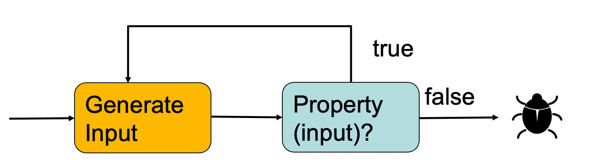
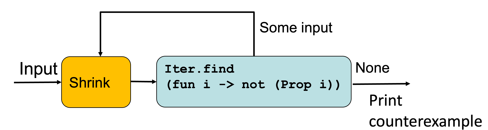

## QCheck: Property-Based Randomized Testing

Writing good unit tests are difficult. Let's test `rev` (list reverse) with a unit test
```
let rec rev l = 
  match l with 
   [] -> []
   | h::t -> rev t @ h

let test_reverse = reverse [1;2;3] = [3;2;1]
```
But this test does not show if the `rev` function works correctly with large lists, lists with large integers, lists with duplicate values, string lists with unicode characters, etc. 

Instead of unit tests on specific inputs and outputs, what if we could test properties that hold for all inputs? For example, `rev` function has the following property: reversing a list twice gives back the original list.
```
let prop_reverse l = rev (rev l) = l
```
In other words, each of the following evaluates to true: 
```
prop_reverse []
prop_reverse [1; 2; 3]
prop_reverse [1.0; 2.22]
```
### QCheck: Property-based Randomized Testing
[QCheck documentation](https://c-cube.github.io/qcheck/0.6/QCheck.html)

[QCheck Example](examples/qcheck/)
QCheck is a Property-Based Testing framework for OCaml. It is a framework that repeatedly generates random inputs, and uses them to confirm that properties hold. For example, it randomly generaly lists to confirm the `prop-reverse` property of the `rev` function hold. 
```
let prop_reverse l = rev (rev l) = l
```
QCheck tests are described by a generator that generates random inputs and a property, a bool-valued function. The input generator generates a random input and tests if the property holds with the input. If the property holds, it will try again with another random input. If the property does not hold, we just found a counterexample, or a bug. 


### Setting Up QCheck
* To install QCheck module, run
```
   opam install qcheck
```
* In the test module, open the Qcheck module
```
	open QCheck
```
* In utop, before open QCheck, run 
```
	#require “qcheck”
```
In a `dune` project, add the following to the `dune` file:
```
 (libraries qcheck)
```

### Example
```
(* List reverse *)
let rec rev l = 
  match l with 
   [] -> []
   | h::t -> rev t @ h

(* a property that holds for the list reverse *)
let prop_reverse l = rev (rev l) = l


(* #require "qcheck" *)
open QCheck

(* A QCheck test *)
let test =
   Test.make      (* make a test *)
   ~count:1000    (* number of random tests. Change this to a larger number if you want to test more *)
   ~name:”reverse_test”  (* name of the test *)
   (list small_int) (* an arbitrary. Here is generates a list of random ints *)
  (fun x-> prop_reverse x) (* calls the property *)

(* run the QCheck Test *)
QCheck_runner.run_tests ~verbose:true [test];;
```
Test output:
```
generated   error   fail   pass / total     time test name
[✓] 1000      0      0    1000 / 1000     0.2s reverse_test
=====================================================
success (ran 1 tests)
```
It shows that QCheck generated 1000 random tests and all of the 1000 tests passed. 

### Buggy Reverse
Assume the `rev` function is implemented as:
```
let rev l = l  (* returns the same list *)
```
Obviously, this implementation of `rev` is not correct. A simple unit test would catch the bug:
```
let test_reverse = rev [1;2;3] = [3;2;1]
```
However, the property `prop_reverse` does not catch the bug!
```
let prop_reverse l = rev (rev l) = l
```
because the property always holds if `rev` returns the original list without reversing it. Therefore, we need a better property.
```
let prop_reverse2 l1 m l2 =
   rev (l1 @ [m] @ l2) = rev l2 @ [m] @ rev l1
```
This property does not hold for the buggy implementation of `rev`. Fox example:
```
rev [1;2]@[3]@[4;5] = rev [4;5] @ rev [3] @ rev [1;2]
    [1;2;3;4;5] = [4;5;3;1;2] (* property fails *)
```
Now, this property holds only if the `red` is accurate. Lesson learned: Garbage in Garbage out. If the property is wrong, PBT will not detect the bug. 

[Source code of the `rev` and its property-based tests](examples/qcheck/rev/rev.ml)


### Another example: Delete an item from the list
```
let rec delete x l = match l with 
   [] -> []
   | (y::ys) -> if x = y then ys 
                else y::(delete x ys)

```
We want to test the property that if `x` is deleted from the list, it shoud not be a member of this list. 
```
let prop_delete x l = not (List.mem x (delete x l))
```
Test:
```
let test = 
  Test.make 
    ~count:1000 
    ~name:”delete_test" 
    (pair small_int (list small_int)) 
    (fun(x,l)-> prop_delete  x l)
```
Run the test:
```
QCheck_runner.run_tests [test];;
```
It immediately finds a counterexample:
```
--- Failure ----------------------------------------------
Test reverse_test failed (11 shrink steps):
(0, [0; 0])
==========================================================
failure (1 tests failed, 0 tests errored, ran 1 tests)
- : int = 1
```
The counterexample shows that when are duplicates in the list, The `delete` only deleted the first occurrence. For example:
```
delete 2 [2;2;3]  returns [2;3]
```
### Example: `is_sorted`
Write a property `is_sorted` to test whether a list is sorted in non-decreasing order
```
let rec is_sorted lst = 
 match lst with
 | [] -> true 
 | [h] -> true 
 | h1::(h2::t as t2) -> h1 <= h2 && is_sorted t2
```

### Arbitrary
An `'a arbitrary` represents an "arbitrary" value of type `'a`. It is used to describe how to 
* generate random values
* shrink them (make counter-examples as small as possible)
* print them. 
Here a some examples of the arbitraries QCehck offers:
```
small_int:  int arbitrary
list: 	    'a arbitrary -> 'a list arbitrary
triple:     'a arbitrary -> 'b arbitrary -> 'c arbitrary -> ('a * 'b * 'c) arbitrary
```
The type `arbitrary` is defined as:
```
type 'a arbitrary = {
   gen: 'a Gen.t;
   print: ('a ‑> string) option; (** print values *)
   small: ('a ‑> int) option; (** size of example *)
   shrink: 'a Shrink.t option; (** shrink to smaller examples *)
   collect: ('a ‑> string) option; (** map value to tag, and group by tag *)
   stats : 'a stat list;  (** statistics to collect and print *)
}
```
We can build custom an `arbitrary` by calling `QCheck.make`. 
```
make :
  ?print:'a Print.t ->
  ?small:('a -> int) ->
  ?shrink:'a Shrink.t ->
  ?collect:('a -> string) ->
  ?stats:'a stat list -> 'a Gen.t -> 'a arbitrary

```
For example: Let's build an arbitrary that generates random ints:
```
# make (Gen.int);;
- : int arbitrary =
{gen = <fun>; print = None; small = None; shrink = None; collect = None;stats = []}
```
### Random Generator
`'a QCheck.Gen.t` is a function that takes in a Pseudorandom number generator, uses it to produce a random value of type `‘a`. 
For example, `QCheck.Gen.int` generates random integers, while `QCheck.Gen.string` generates random strings. Let us look at  a few more of them:
```
module Gen : 
    sig
      val int : int t
      val small_int : int t
      val int_range : int -> int -> int t
      val list : 'a t -> 'a list t
      val string : ?gen:char t -> string t
      val small_string : ?gen:char t -> string t
      ...
    end
```
### Sampling Generators
* Generate a random small integer
```
Gen.generate1 Gen.small_int
 7
```
* Generate 10 random small integers
```
Gen.generate ~n:10 Gen.small_int
 int list =[6;8;78;87;9;9;6;2;3;27]
```
* Generate 5 int  lists
```
let t = Gen.generate ~n:5 (Gen.list Gen.small_int);;
val t : int list list =[[4;2;7;8;…];…;[0;2;97]]
```
* Generate two string lists
```
let s = Gen.generate ~n:2 (Gen.list Gen.string);;
val s : string list list =[[ “A”;”B”;…]; [“C”;”d”;…]]
```

#### Combining Generators
```
frequency:(int * ‘a) list ->‘a ‘a Gen.t
oneof: 'a Gen.t list -> 'a Gen.t 
```
* Generate 80% letters, and 20% space 
``` 
 Gen.generate ~n:10 
    (Gen.frequency [(1,Gen.return ' ‘);
    (4,Gen.char_range 'a' 'z')]);;
- : char list=['i';' ';'j';'h';'t';' ';' ';' ';'k';'b']
```

* Generate one of the parenthesis `[,],(,),{,}`
```
Gen.generate1 (Gen.oneof [
              return "[";
              return "(";
              return "{";
              return "]";
              return ")";
              return "}"
            ]);;
- : string = "]"
```
### Shrinking
Shrinking is used to reduce the size of a counter-example. It tries to make the counter-example smaller by decreasing it, or removing elements, until the property to test holds again; then it returns the smallest value that still made the test fail. Therefore, a shrinker attempts to cut a counterexample down to something more comprehensible for humans.  A QCheck shrinker is a function from a counterexample to an iterator of simpler values: 
```
'a Shrink.t = 'a -> 'a QCheck.Iter.t
```
Without shrinking, the `delete` test would return the following counterexample. 
```
--- Failure -------------------------------
Test anon_test_1 failed (0 shrink steps):

(7, [0; 4; 3; 7; 0; 2; 7; 1; 1; 2])
```
With shrinking, it returns:
```
--- Failure -------------------------------
Test anon_test_1 failed (8 shrink steps):

(2, [2; 2])
```
It is much easier to debug the `delete` function with the counterexample `[2;2]` than `[0; 4; 3; 7; 0; 2; 7; 1; 1; 2]`. 

#### How does shrink work?
How do we go from:
```
(7, [0; 4; 3; 7; 0; 2; 7; 1; 1; 2])
```
to:
```
(2, [2; 2])
```
Given a counterexample, QCheck calls the iterator to find a simpler value, that is still a counterexample. The steps are as follows:

* Given a shrinking function  f ::‘a -> ‘a list 
* And a counterexample x :: ‘a
* Try all elements of (f x) to find another failing input…
* Repeat until a minimal one is found.


QCheck’s Shrink contains a number of builtin shrinkers: 

* Shrink.nil performs no shrinking 
* Shrink.int  for reducing integers 
* Shrink.char for reducing characters 
* Shrink.string for reducing strings 
* Shrink.list for reducing lists 
* Shrink.pair for reducing pairs 
* Shrink.triple for reducing triples 

For implementing a custom shrink, look at the examples [even_number](examples/qcheck/even_number/) and [Balanced Brackets](examples/qcheck/balanced_brackets_buggy/). 

### Printers
Printers print a values of type 'a.
Type:
```
   type ‘a printer = ‘a -> string
```
Printers for primitives:
* val pr_bool : bool printer	
* val pr_int  : int  printer
* val pr_list : ‘a printer -> ‘a list printer


### Summary
We’ve taken a brief look at QCheck Property Based Testing
* how to generate random tests
* how to build an arbitrary
* how to use shrinkers
