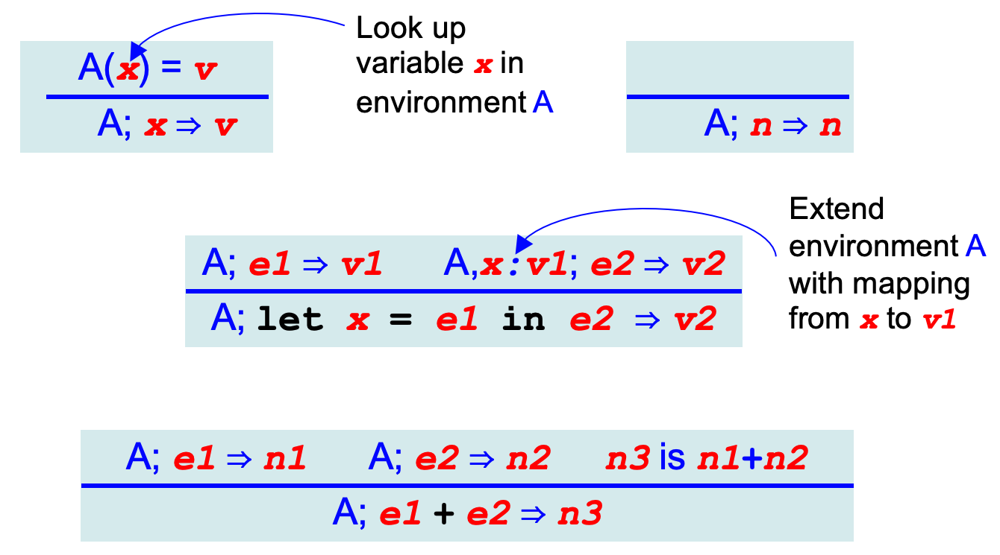

## Formal Semantics of a Programming Language 
Sematics is the mathematical description of the meaning of programs written in that language. It describes what a program computes, and what it does. 

There are three main approaches to formal semantics:
* Denotational semantics:  translate programs into math!
    * Usually: convert programs into functions mapping inputs to outputs. 
    * Analogous to compilation

* Operational semantics: define how programs execute. 
    * Often on an abstract machine (mathematical model of computer). 
    * Analogous to interpretation

* Axiomatic semantics: 
    * Describe programs as predicate transformers, i.e. for converting initial assumptions into guaranteed properties after execution Preconditions:  assumed properties of initial states Postcondition:  guaranteed properties of final states
    * Logical rules describe how to systematically build up these transformers from programs

### Operational Semantics
We will show how an operational semantics may be defined for Micro-Ocaml and develop an interpreter for it, along the way by using rules to define a judgement.
```
e ⇒ v
```
Says “e evaluates to v”
* e:  expression in Micro-OCaml
* v:  value that results from evaluating e

### Definitional Interpreter
Rules for judgement e ⇒ v can be easily turned into idiomatic OCaml code for an interpreter
* The language’s expressions e and values v have corresponding OCaml datatype representations exp and value
* The semantics is represented as a function 
```
eval: exp -> value
```
This way of presenting the semantics is referred to as a definitional interpreter
The interpreter defines the language’s meaning. 

We use a grammar for e to directly describe an expression’s abstract syntax tree (AST), i.e., e’s structure
```
  e ::= x | n | e + e | let x = e in e 
```
corresponds to (in definitional interpreter) 
```
type id = string
type num = int
type exp = 
    | Ident of id               (* x *)
    | Num of num                (* n *)
    | Plus of exp * exp         (* e+e *)
    | Let of id * exp * exp     (* let x=e in e *)
```

### Micro-OCaml Expression Grammar
```
e ::= x | n | e + e | let x = e in e 
```

e, x, n are meta-variables that stand for categories of syntax (like non-terminals in a CFG)
* x is any identifier (like z, y, foo)
* n is any numeral (like 1, 0, 10, -25)
* e is any expression (here defined, recursively!)

Concrete syntax of actual expressions are `let, +, z, foo, in, …` (like terminals in a CFG)

#### Examples 
* 1 is a numeral n which is an expression e
* 1+z is an expression e because 
    * 1 is an expression e, 
    * z is an identifier x, which is an expression e, and 
    * e + e is an expression e
* let z = 1 in 1+z is an expression e because 
    * z is an identifier x, 
    * 1 is an expression e , 
    * 1+z is an expression e, and 
    * let x = e in e is an expression e 
### Values
A value v is an expression’s final result 
```
v ::= n
```
For now, the values for the Micro-OCaml are ust numerals. 
* In terms of an interpreter’s representation: 
```
	type value = int
```
In a full language, values v will also include booleans (true, false), strings, functions, …

#### Defining the Semantics
Use rules to define judgment  e ⇒ v. Judgments are just statements. We use rules to prove that the statement is true.
* 1+3 ⇒ 4
    * 1+3 is an expression e, and 4 is a value v
    * This judgment claims that 1+3 evaluates to 4 
    * We use rules to prove it to be true
* let foo=1+2 in foo+5 ⇒ 8
* let f=1+2 in let z=1 in f+z ⇒ 4
### Rules as English Text
* Suppose e is a numeral n 
    * Then e evaluates to itself, i.e., n ⇒ n
* Suppose e is an addition expression e1 + e2 
    * If e1 evaluates to n1, i.e., e1 ⇒ n1
    * And if e2 evaluates to n2, i.e., e2 ⇒ n2
    * Then e evaluates to n3, where n3 is the sum of n1 and n2
    * I.e., e1 + e2 ⇒ n3
* Suppose e is a let expression let x = e1 in e2 
    * If e1 evaluates to v, i.e., e1 ⇒ v1
    * And if e2{v1/x} evaluates to v2, i.e., e2{v1/x} ⇒ v2
        *   Here, e2{v1/x} means “the expression after substituting occurrences of x in e2 with v1” 
    *  Then e evaluates to v2, i.e., let x = e1 in e2 ⇒ v2

The rules are compositional. Compositional semantics are very useful because we can give inductive proofs for many program/language properties. 

### Rules of Inference
We can use a more compact notation for the rules we just presented: rules of inference
Has the following format


It says if the conditions `H1   …   Hn` (“hypotheses”) are true, then the condition `C` (“conclusion”) is true. 

If `n=0` (no hypotheses) then the conclusion automatically holds; this is called an axiom
We are using inference rules where `C` is our judgment about evaluation, i.e., that e ⇒ v


### Rules of Inference
#### Num
Suppose e is a numeral n, then e evaluates to itself, i.e., n ⇒ n


This rules translates to the code
```
let rec eval (e:exp):value =
  match e with 
  | Num n -> n
```
#### Sum
Suppose e is an addition expression e1 + e2 
* If e1 evaluates to n1, i.e., e1 ⇒ n1
* If e2 evaluates to n2, i.e., e2 ⇒ n2
* Then e evaluates to n3, where n3 is the sum of n1 and n2, i.e., e1 + e2 ⇒ n3

This rules translates to the code
```
let rec eval (e:exp):value =
  match e with 
  | Plus (e1,e2) ->
     let n1 = eval e1 in
     let n2 = eval e2 in
     let n3 = n1+n2 in
     n3
```
#### Let
Suppose e is a let expression let x = e1 in e2 
* If e1 evaluates to v, i.e., e1 ⇒ v1
* If e2{v1/x} evaluates to v2, i.e., e2{v1/x} ⇒ v2
* Then e evaluates to v2, i.e., let x = e1 in e2 ⇒ v2


This rules translates to the code
```
| Let (x,e1,e2) ->
     let v1 = eval e1 in
     let e2’ = subst v1 x e2 in
     let v2 = eval e2’ in v2
```
### Derivations
When we apply rules to an expression in succession, we produce a derivation
It’s a kind of tree, rooted at the conclusion. 

We produce a derivation by goal-directed search. That is 
* Pick a rule that could prove the goal
* Then repeatedly apply rules on the corresponding hypotheses

Goal: Show that let x = 4 in x+3 ⇒ 7


* Quiz : What is derivation of the following judgment?
```
2 + (3 + 8) ⇒ 13
```
Solution:


### Definitional Interpreter
The style of rules lends itself directly to the implementation of an interpreter as a recursive function 
```
let rec eval (e:exp):value =
  match e with
    Ident x -> (* no rule *)
     failwith “no value”
  | Num n -> n
  | Plus (e1,e2) ->
     let n1 = eval e1 in
     let n2 = eval e2 in
     let n3 = n1+n2 in
     n3
  | Let (x,e1,e2) ->
     let v1 = eval e1 in
     let e2’ = subst v1 x e2 in
     let v2 = eval e2’ in v2
```
You can find the substitution based evaluator [here](examples/eval_subst.ml)

### Derivations can be generated by tracing the Interpreter Call Trees

Has the same shape as the recursive call tree of the interpreter:


### Semantics Defines Program Meaning
* e ⇒ v holds if and only if a proof can be built
    * Proofs are derivations: axioms at the top, then rules whose hypotheses have been proved to the bottom
    * No proof means there exists no v for which e ⇒ v 
*Proofs can be constructed bottom-up
    * In a goal-directed fashion
* Thus, function eval e = {v | e ⇒ v } 
    * Determinism of semantics implies at most one element for any e
So: Expression e means v

### Environment-style Semantics
* So far, semantics used substitution to handle variables. As we evaluate, we replace all occurrences of a variable x with values it is bound to

* An alternative semantics, closer to a real implementation, is to use an environment
    * As we evaluate, we maintain an explicit map from variables to values, and look up variables as we see them

### Environments
Mathematically, an environment is a partial function from identifiers to values. 
If `A` is an environment, and x is an identifier, then A(x) can either be:
* a value `v` (intuition: the value of the variable stored on the stack)
* undefined (intuition: the variable has not been declared)

An environment can visualized as a table
If A is 
| Id | Value |
| - | - |
| x | 0 |
| y | 2 |


then A(x) is 0, A(y) is 2, and A(z) is undefined

### Notation, Operations on Environments

We use `•` to denote the empty environment. `A,x:v` is the environment that extends `A` with a mapping from `x` to `v`. Sometimes just write `x:v` instead of `•,x:v` for brevity. If `A` maps `x` to some `v’`, then that mapping is shadowed by in `A,x:v`
Lookup A(x) is defined as follows
| LookupEnv | Value |
| - | - |
| •(x) | undefined |
| (A, y:v)(x)  |  v   if x = y |
| (A, y:v)(x)  |  A(x)   if x <> y |
| (A, y:v)(x)  |  undefined	      otherwise |

Here is one implementation of the environment
```
type env = (id * value) list

let extend env x v = (x,v)::env

let rec lookup env x =
  match env with
    [] -> failwith “undefined”
  | (y,v)::env’ -> 
    if x = y then v
    else lookup env’ x
```
An environment is just a list of mappings, which are just pairs of variable to value: called an association list 


### Semantics with Environments
The environment semantics changes the judgment
```
e ⇒ v
```
to be
```
A; e ⇒ v
```
where A is an environment. The idea is that `A` is used to give values to the identifiers in e.
`A` can be thought of as containing declarations made up to e. 

We can modify the previous rules by 
* Inserting A everywhere in the judgments	
* Adding a rule to look up variables x in A 
* Modifying the rule for let to add x to A 

### Environment-style Rules


Now, the definitional interpreter for the environment style evaluation is
```
let rec eval env e =
  match e with
    Ident x -> lookup env x
  | Num n -> n
  | Plus (e1,e2) ->
     let n1 = eval env e1 in
     let n2 = eval env e2 in
     let n3 = n1+n2 in
     n3
  | Let (x,e1,e2) ->
     let v1 = eval env e1 in
     let env’ = extend env x v1 in
     let v2 = eval env’ e2 in v2
```
### Adding Conditionals to Micro-OCaml
Now, we want to extend the Micro-OCaml to support conditionals. 
```
e ::= x | v | e + e | let x = e in e 
   | eq0 e | if e then e else e
```

```
v ::= n | true | false
```
In terms of interpreter definitions:  
* We add the new value type Bool.
```
type value = 
    Int of int
  | Bool of bool
```
* We add `Eq0` and `If` to AST
```
type exp = 
| Ident of id 
| Val of value
| Plus of exp * exp
| Let of id * exp * exp
| Eq0 of exp
| If of exp * exp * exp
```
#### Rules for `Eq0` and Booleans

Booleans evaluate to themselves
```
A; false ⇒ false
```
eq0 tests for 0
```
A; eq0 0 ⇒ true
A; eq0 3+4 ⇒ false
```
#### Rules for Conditionals

Notice that only one branch is evaluated
```
A; if eq0 0 then 3 else 4 ⇒ 3
A; if eq0 1 then 3 else 4 ⇒ 4
```

Now, we update the Interpreter with conditionals:
```
let rec eval env e =
  match e with
    Ident x -> lookup env x
  | Val v -> v
  | Plus (e1,e2) ->
     let Int n1 = eval env e1 in
     let Int n2 = eval env e2 in
     let n3 = n1+n2 in
     Int n3
  | Let (x,e1,e2) ->
     let v1 = eval env e1 in
     let env’ = extend env x v1 in
     let v2 = eval env’ e2 in v2
  | Eq0 e1 -> 
     let Int n = eval env e1 in
     if n=0 then Bool true else Bool false
  | If (e1,e2,e3) ->
     let Bool b = eval env e1 in
     if b then eval env e2
     else eval env e3

```
You can find the environment based evaluator [here](examples/interp.ml)
### Adding Closures to Micro-OCaml
Expression:
```
e ::= x | v | e + e | let x = e in e 
   | eq0 e | if e then e else e
   | e e | fun x -> e

```
Value:
```
   v ::= n | true | false | (A,λx.e)  
```
In `(A,λx.e)`, `A` denotes the environment, `x` denotes the `id` and `e` denotes the expression in `fun x->e`.

In terms of interpreter definitions:  
```
type value = 
    Int of int
  | Bool of bool
  | Closure of env * id * exp 

```
and
```
type exp =
  | Val of value 
  | If of exp * exp * exp
   … (* as before *)
  | Call of exp * exp
  | Fun of id * exp 

```
Rule for Closures: Lexical/Static Scoping


Creating a closure captures the current environment `A`. Calling a function evaluates the body of the closure’s code e with function closure’s environment A’ extended with parameter x bound to argument v1

Rule for Closures: Dynamic Scoping


Creating a closure ignores the current environment `A`. Calling a function evaluates the body of the closure’s code e with the current environment A extended with parameter x bound to argument v1. 
### Scaling up
Operational semantics (and similarly styled typing rules) can handle full languages
with records, recursive variant types, objects, first-class functions, and more

It provides a concise notation for explaining what a language does. Clearly shows:
* Evaluation order
* Call-by-value vs. call-by-name
* Static scoping vs. dynamic scoping
